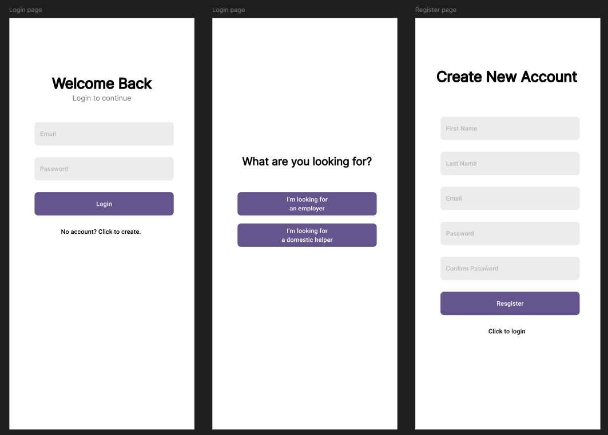
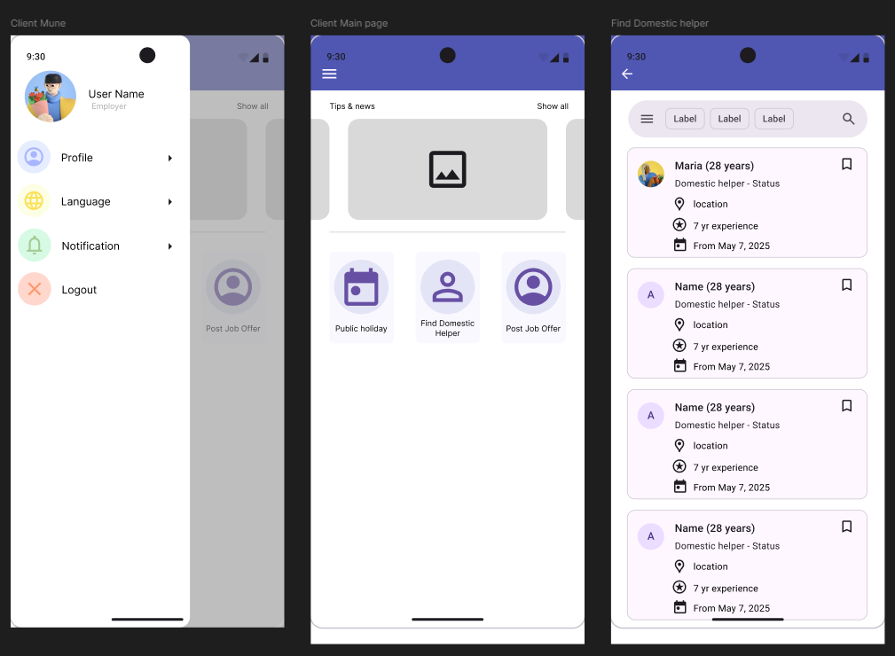
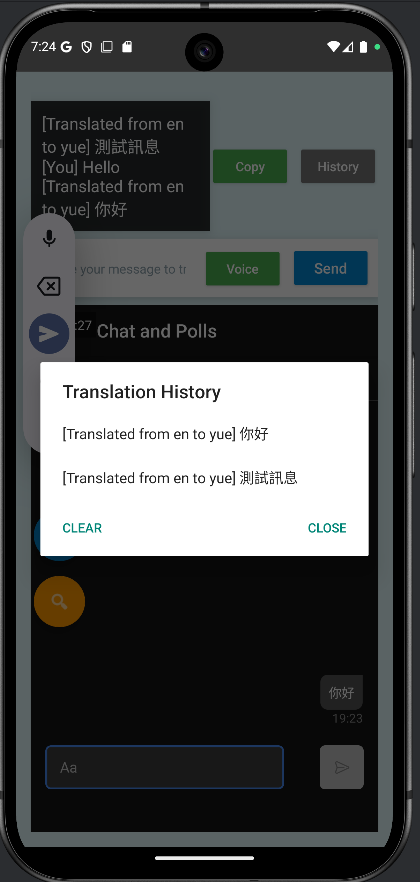
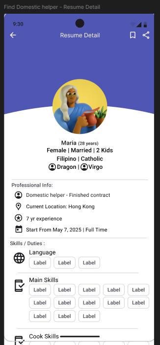
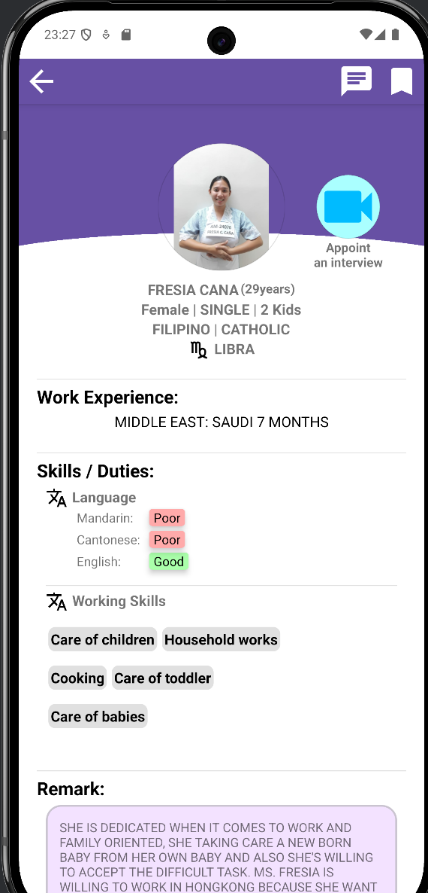
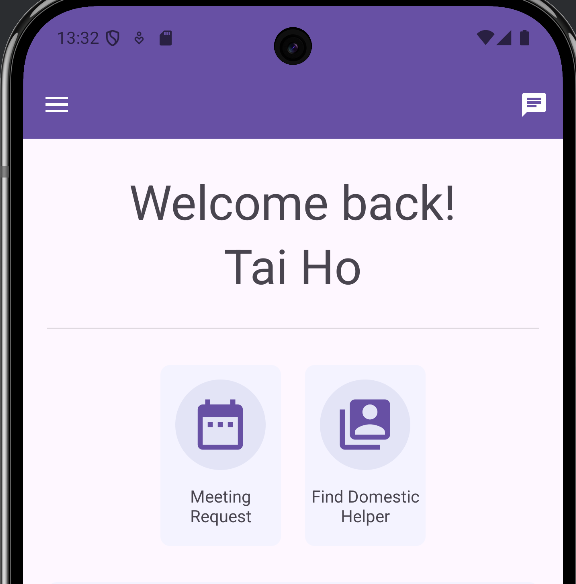

# AI-Enhanced Domestic Helper Hiring App

[](https://developer.android.com)
[](https://kotlinlang.org)
[](https://firebase.google.com)
[](#license)

An Android application that streamlines domestic helper hiring in Hong Kong — built as a **Final Year Project** at Hong Kong Metropolitan University (2024–2025). Led a 4-person team; delivered a **35% efficiency gain** over traditional manual hiring workflows in user testing.

## Screenshots

| Login & register | Dashboard | Multilingual chat |
|:---:|:---:|:---:|
|  |  |  |

| Resume detail | CV skills profile | Home (device) |
|:---:|:---:|:---:|
|  |  |  |

## Overview

Finding and hiring a domestic helper in Hong Kong involves significant manual effort — reviewing resumes, scheduling interviews, and managing communication across language barriers. This app automates that process with AI-powered matching, real-time translation, and in-app video interviews.

## Features

- **AI candidate matching** — Hybrid rule-based + scikit-learn engine parses PDF CVs, extracts skills/languages, and ranks employer–helper compatibility
- **Real-time chat** — Firebase instant messaging between employers and helpers
- **Multilingual support** — Live translation across English, Cantonese, Filipino, and Indonesian (MyMemory API)
- **Video interviews** — Jitsi Meet SDK embedded in-app
- **Booking management** — Interview and appointment scheduling end-to-end
- **Role-based access** — Separate flows for employers, helpers, and admins
- **Advanced search** — Filter by skills, language, experience, and availability

## Tech stack

| Layer | Technology |
|-------|------------|
| Language | Kotlin (Coroutines) |
| IDE | Android Studio |
| Backend & auth | Firebase (Auth, Realtime Database, Cloud Messaging) |
| ML & matching | scikit-learn, Chaquopy |
| Resume parsing | pdfplumber |
| Translation | MyMemory API |
| Video calls | Jitsi Meet SDK |

## Architecture

```
Android app (Kotlin)
    ├── Firebase Auth / Realtime DB / FCM
    ├── MyMemory API (chat translation)
    ├── Jitsi Meet SDK (video interviews)
    └── ML pipeline (Chaquopy)
            ├── pdfplumber → CV text extraction
            └── scikit-learn → candidate ranking
```

## How matching works

1. Helper uploads a CV (PDF)
2. `pdfplumber` extracts raw text
3. Skills, languages, and experience are structured
4. Hybrid rules + `scikit-learn` score fit against employer requirements
5. Ranked matches surface to the employer in real time

## Getting started

### Prerequisites

- Android Studio (latest stable)
- Android device or emulator (API 26+)
- Firebase project with Realtime Database and Auth enabled
- MyMemory API key (optional for translation features)

### Setup

1. Clone the repo and open the **`FypProject`** folder in Android Studio (not the repo root).

```bash
git clone https://github.com/singhRamandeep101/Domestic-helper-app.git
cd Domestic-helper-app/FypProject
```

2. Add `google-services.json` from Firebase Console to `FypProject/app/`
3. Add your MyMemory API key to `local.properties`:

```properties
MYMEMORY_API_KEY=your_key_here
```

4. Sync Gradle and run on an emulator or device.

> **Note:** Firebase credentials are not committed. Use your own Firebase project for local development.

## Team

| Role | Name |
|------|------|
| Project lead & full-stack developer | **Ramandeep Singh** |
| Team members | HKMU FYP group (4-person team) |

## License

Academic project — for demonstration and portfolio purposes. Contact [singhramandeep0910@gmail.com](mailto:singhramandeep0910@gmail.com) for enquiries.
